# Examen de Certificación de Talento Digital | Ignacio Cavallo
## Android Dev Trainee 

## Link: https://github.com/cavigna/Certificacion_Talento_Digital_Android
Este es el proyecto de certificación de Talento Digital para el diplomado de Android Developer Trainee. Esta aplicación está:
- Escrita en:  
- Desarrollada para: 
- Construida con:  
- Usa para la persistencia de datos: 
- Desarrollado en el IDE: 


# Requerimientos

- > **Considerando que para esta primera versión se busca tener una gran cobertura de dispositivos manteniendo los costos de mantención bajos, la API mínima debe ser 23 y el target 30.**

```gralde
    defaultConfig {
        applicationId "com.cavigna.talentodigital"
        minSdk 23
        targetSdk 30
        versionCode 1
        versionName "1.0"        
        testInstrumentationRunner "com.cavigna.talentodigital.app.TestRunner"
    }

```

> **La primera pantalla de la app debe ser una lista de las monedas ofrecidas (Recyclerview).**
> **Se recomienda utilizar una actividad y múltiples fragmentos.**

Esta aplicación consiste en una sola Actividad, que contiene dos fragmentos:
- HomeFragment 
- DetailsFragment


## HomeFragment
Al iniciar la app consulta al viewmodel, el listado de monedas el cual(viewmodel) se lo solicita al repositrio, el cual consume de la DB.

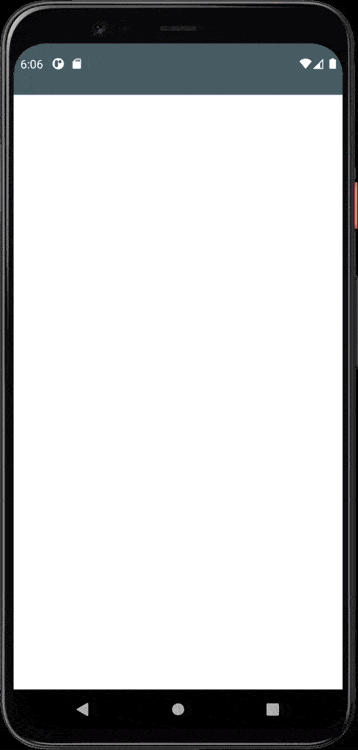

> **La segunda pantalla muestra la información en detalle de la moneda seleccionada.**
>  -  Debe tener un botón para solicitar información (Este deberá ejecutar un intent implícito a una app de correo electrónico, con los datos necesarios).
```xml
<androidx.coordinatorlayout.widget.CoordinatorLayout xmlns:android="http://schemas.android.com/apk/res/android"
    xmlns:app="http://schemas.android.com/apk/res-auto"
    xmlns:tools="http://schemas.android.com/tools"


    <!-- ..... -->

    <ProgressBar
<!-- ..... --> />

    <com.google.android.material.appbar.AppBarLayout
        android:id="@+id/appbar"

        <!-- ..... -->

        <com.google.android.material.appbar.CollapsingToolbarLayout
            <!-- ..... -->

            <ImageView
                <!-- ..... -->

            <androidx.appcompat.widget.Toolbar
                <!-- ..... -->
                ></androidx.appcompat.widget.Toolbar>
        </com.google.android.material.appbar.CollapsingToolbarLayout>
    </com.google.android.material.appbar.AppBarLayout>

    <androidx.core.widget.NestedScrollView
        <!-- ..... -->
        >

        <ScrollView
            <!-- ..... -->

            <LinearLayout

```

## Details Fragment
### Detalle de Moneda
> **Se recomienda que la segunda pantalla tenga la posibilidad de hacer scroll para visualizarel contenido de forma correcta y que se ajuste a cualquier tamaño de pantalla.**

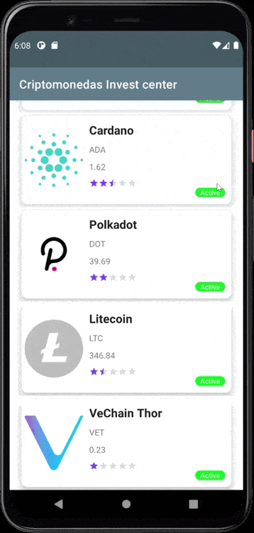

### Intent Email | collapsible toolbar | floating action

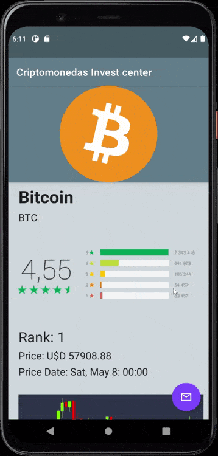

>**Cuando el usuario está viendo el detalle de una Moneda seleccionada, al hacer click sobre algún botón, tiene que enviarse un correo con la siguiente información pre llenada:**
    ● Destinatario: Info@cryptoinvest.cl
    Asunto: Solicito información sobre esta criptomoneda ID {ID}
    ● Mensaje:
“Hola Quisiera pedir información sobre esta moneda {NAME}, me gustaría que me contactaran a este correo o al siguiente número _________ Quedo atento.”

```kotlin
fun sendEmailIntent(coinDetails: CoinDetails, context: Context) {

    val i = Intent(Intent.ACTION_SEND)
    i.type = "message/rfc822"

    i.putExtra(Intent.EXTRA_EMAIL, arrayOf("email@emial.com"))
    i.putExtra(Intent.EXTRA_SUBJECT, ": Solicito información sobre  ${coinDetails.id}")
    i.putExtra(
        Intent.EXTRA_TEXT, "“Hola\n" +
                "Quisiera pedir información sobre este moneda ${coinDetails.name}, " +
                "me gustaría que me contactaran a\n" +
                "este correo o al siguiente número _________\n" +
                "Quedo atento.”\n"
    )

    try {
        context.startActivity(Intent.createChooser(i, "Send mail..."))
    } catch (ex: ActivityNotFoundException) {
        Toast.makeText(
            context,
            R.string.error_email,
            Toast.LENGTH_SHORT
        ).show()
    }
}
```


#Arquitectura | Librerías

>**La arquitectura del aplicativo puede ser MVP-LiveData-ROOM o MVVM-LiveData-ROOM.**
>   ○ Debe guardar los datos en la persistencia del teléfono(ROOM) y mostrarlos en las vistas correspondientes.

## ViewModel | LiveData | Flow
```kotlin
@HiltViewModel
class MainViewModel @Inject constructor(
    private val repo: Repositorio
): ViewModel() {
    
    init {
        selectAllCoins()
    }

    private val _listOfCoins: MutableLiveData<List<Coin>> = MutableLiveData(listOf())
    val listOfCoins:LiveData<List<Coin>> = _listOfCoins

    private val _coinDetails: MutableLiveData<CoinDetails> = MutableLiveData(CoinDetails())
    val coinDetails: LiveData<CoinDetails> = _coinDetails

    private fun selectAllCoins(){
        viewModelScope.launch(IO) {
            repo.fetchOrSelectListOfCoins().collect {
                _listOfCoins.postValue(it)
            }
        }
    }

    fun selectOrFetchCoinDetails(id:String){
        viewModelScope.launch(IO) {
            _coinDetails.postValue(CoinDetails())
            repo.fetchOrSelectCoinDetails(id).collect {
                _coinDetails.postValue(it)
            }
        }
    }
}
```

## Repositorio | Room | Flow

```kotlin
package com.cavigna.talentodigital.model


import android.util.Log
import com.cavigna.talentodigital.model.local.db.CoinDao
import com.cavigna.talentodigital.model.models.Coin
import com.cavigna.talentodigital.model.models.CoinDetails
import com.cavigna.talentodigital.model.remopte.api.ApiService
import kotlinx.coroutines.flow.*
import javax.inject.Inject

class Repositorio @Inject constructor(
    private val api: ApiService,
    private val dao: CoinDao
) {
    /**
     * Función que controla si la DB contiene información, en caso contrario llama a la api,
     * guarda la info y la emite desde la DB. Cuando está llena la db, no realiza una llamada innecesaria
     * a la API
     */
    suspend fun fetchOrSelectListOfCoins(): Flow<List<Coin>> = flow {
        val coinsDB = dao.selectAllCoins()
        if (coinsDB.isEmpty()){
            val coinsApi = api.fetchListOfCoins()
            dao.insertListOfCoins(coinsApi)
        }
        emit(dao.selectAllCoins())
    }

    /**
     * Al igual que la anterior, solo llama a la API si la información no esta en la DB. 
     * Solo consume de la DB
     */
    suspend fun fetchOrSelectCoinDetails(id:String):Flow<CoinDetails> = flow {
        val coinDetailsDB:CoinDetails = dao.selectCoinDetails(id)

        if (flowOf(coinDetailsDB).firstOrNull() == null){
            val coinDetailsApi = api.fetchCoinDetails(id)
            dao.insertCoinDetails(coinDetailsApi)
            Log.v("repositorio", "EMITIDO DE LA API")
            emit(coinDetailsApi)
        }else{
            emit(coinDetailsDB)
            Log.v("repositorio", "EMITIDO DE LA DB")
        }

    }

}
```

## ROOM | Retrofit

```kotlin
@Dao
interface CoinDao {

    @Insert(onConflict = OnConflictStrategy.REPLACE)
    suspend fun insertListOfCoins(listOfCoins: List<Coin>)

    @Query("SELECT * FROM coins_table")
    suspend fun selectAllCoins(): List<Coin>


    @Insert(onConflict = OnConflictStrategy.REPLACE)
    suspend fun insertCoinDetails(coinDetails: CoinDetails)

    @Query("SELECT * FROM coin_details_table WHERE id=:id")
    suspend fun selectCoinDetails(id: String): CoinDetails

}
```
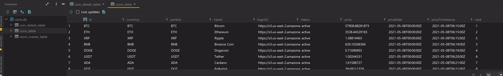

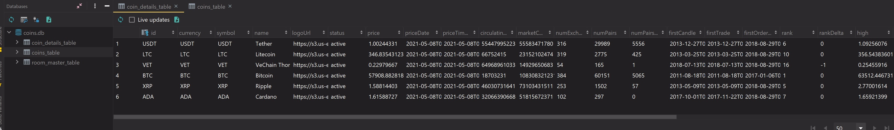

> **Los request HTTP deben ser realizados utilizando la librería Retrofit.**
>   Si utiliza Kotlin, debe usar Coroutines para manejar el trabajo asíncrono

```kotlin
interface ApiService {

    @GET("general")
    suspend fun fetchListOfCoins():List<Coin> // ==> Suspend Function ==>Corrutinas

    @GET("details/{id}")
    suspend fun fetchCoinDetails(
        @Path("id") id:String
    ): CoinDetails

}

@Module
@InstallIn(SingletonComponent::class)
object DataModule {
    @Singleton
    @Provides
    fun providesRetrofit(): ApiService = Retrofit.Builder()
        .baseUrl("https://fake-server-app-crypto.herokuapp.com/")
        .addConverterFactory(GsonConverterFactory.create())
        .build()
        .create(ApiService::class.java)

    @Singleton
    @Provides
    fun providesDatabase(@ApplicationContext context: Context) =
        Room.databaseBuilder(context, BaseDeDatos::class.java, "coins.db").build()

    @Singleton
    @Provides
    fun providesCoinDao(db: BaseDeDatos) = db.dao
}
```

# Testing
> Preocupados por la calidad del código y estabilidad de la app, se ha definido un mínimo de test a llevar a cabo
>**● Al menos un test unitario**
> **● Al menos un test instrumental.**

## Unit
```kotlin
class UnitTestApp {

    @Test
    fun `testPrice`(){
        val actual  = precioUSD(8990)
        val expected = "Precio: USD 8990,00"
        assertEquals(actual,expected )
    } 

    @Test
    fun`testRedeondeo`(){
        val actual  = redondeo("8990")
        val expected = "8990,00"

        assertEquals(actual, expected)

    }
}
```
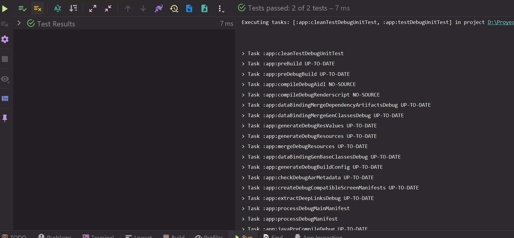

## Instrumental

### Remote

>**Test unitario que verifique la respuesta de los endpoints usando un servidor de pruebas como mockwebserver.**

```kotlin
package com.cavigna.talentodigital

@ExperimentalCoroutinesApi
@HiltAndroidTest
@SmallTest
class RemoteTest {

    @get:Rule
    var hiltRule = HiltAndroidRule(this)

    @get:Rule
    var instantTaskExecutorRule = InstantTaskExecutorRule()

    private val dispatcher = TestCoroutineDispatcher()
    private val testScope = TestCoroutineScope(dispatcher)


    private val server = MockWebServer()

    private lateinit var service: ApiService

    private val coinDetailsMock = CoinDetails(
        "ETH","ETH","ETH","Ethereum",
        "https://s3.us-east-2.amazonaws.com/nomics-api/static/images/currencies/eth.svg",
        "active","3538.44529165","2021-05-08T00:00:00Z",
        "2021-05-08T06:15:00Z","115785365","409700180507",
        "387","40629","25629",  "2015-08-07T00:00:00Z",
        "2015-08-07T00:00:00Z","2018-08-29T00:00:00Z","2","0",
        "3545.46612020","2021-05-08T00:00:00Z",
        D(
            "59414294288.88", "99.40150754", "0.0289",
            "-3886350195.15", "-0.0614", "11555867487.59",
            "0.0290"
        )
    )

    @Before
    fun init() {
        server.start(8000)

        val BASE_URL = server.url("/").toString()

        service = Retrofit.Builder()
            .addConverterFactory(GsonConverterFactory.create())
            .baseUrl(BASE_URL)
            .build().create(ApiService::class.java)

        server.apply {
            enqueue(
                MockResponse()
                    .setResponseCode(200)
                    .setBody(FileReader.readStringFromFile("mock_response.json"))
            )
        }
    }

    @After
    fun teardown() {
        server.shutdown()

    }


    @Test
    fun testApiSuccess() {
        testScope.launch {
            val coinDetails = service.fetchCoinDetails("ETH")
            assertThat(coinDetailsMock).isEqualTo(coinDetails)
        }
    }


}
```


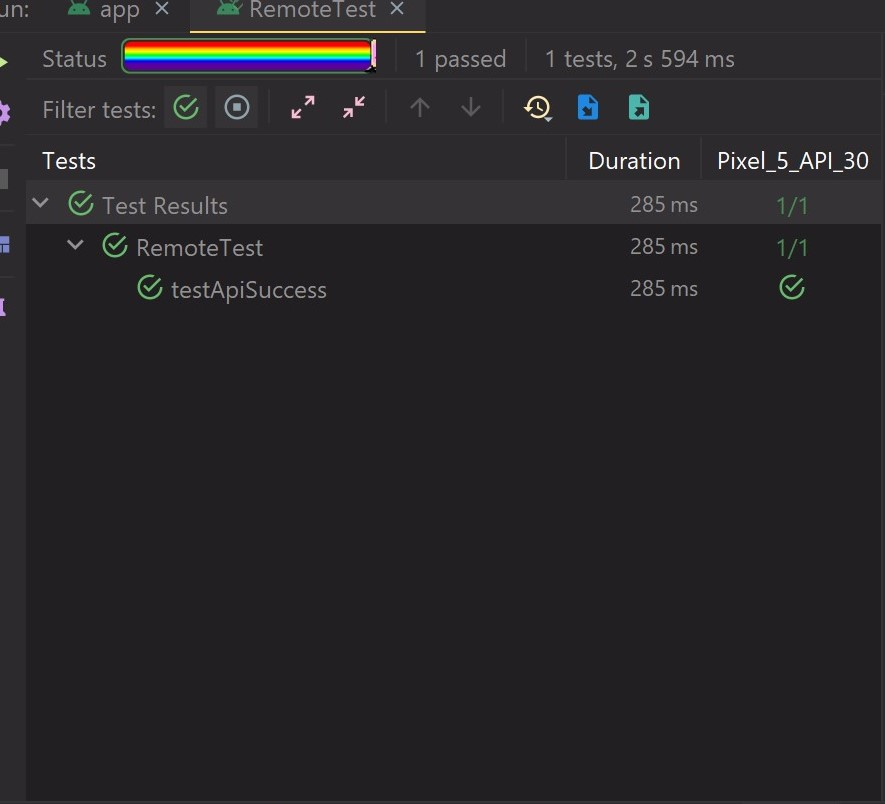

### Local
>**Test instrumental que compruebe la persistencia de datos con ROOM.**
```kotlin
@HiltAndroidTest
@SmallTest
class LocalTestDB {
    @get:Rule
    var hiltRule = HiltAndroidRule(this)

    @get:Rule
    var instantTaskExecutorRule = InstantTaskExecutorRule()

    @Inject
    @Named("test.db")
    lateinit var db: BaseDeDatos

    private lateinit var  dao: CoinDao

    @Before
    fun init(){
        hiltRule.inject()
        dao = db.dao
    }

    @After
    fun tearDown() {
        db.close()
    }

    @ExperimentalCoroutinesApi
    @Test
    fun `insertCoinTest`(): Unit = runBlockingTest{
        val coin = Coin("TSL", "TESLACoin")


        dao.insertListOfCoins(listOf(coin))

        val allCoins = dao.selectAllCoins()


        assertThat(allCoins).contains(coin)


    }

    @ExperimentalCoroutinesApi
    @Test
    fun insertCoinDetailsTest() = runBlockingTest {
        val coinDetail = CoinDetails("TSLA")

        dao.insertCoinDetails(coinDetail)
        assertThat(dao.selectCoinDetails("TSLA")).isEqualTo(coinDetail)
    }
}
```

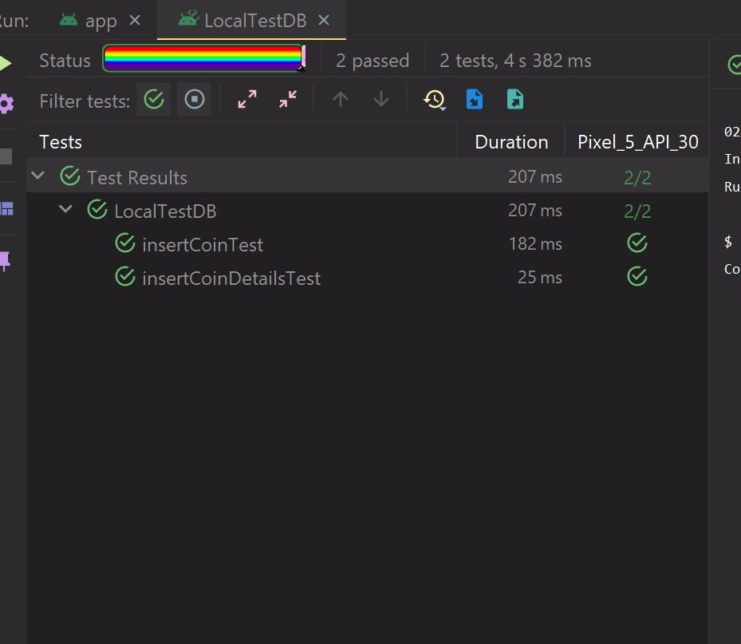


# Design
>**Use la siguiente paleta para los colores de la aplicación:**
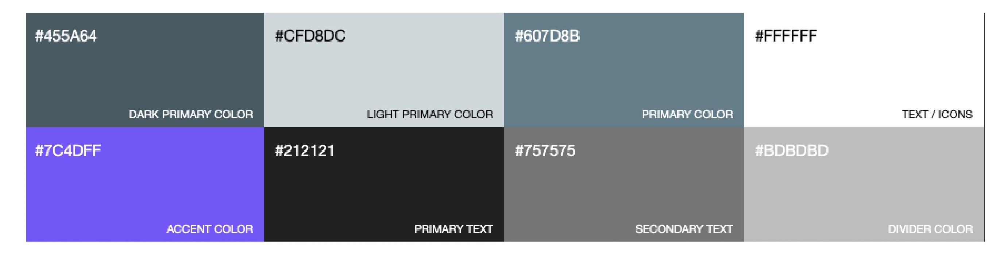

```xml
    <color name="dark_primary">#455a64</color>
    <color name="light_primary">#CFD8DC</color>
    <color name="primary_color">#607D8B</color>

    <color name="text_color">#FFFFFF</color>
    <color name="accent_color">#7C4DFF</color>
    <color name="primary_text">#212121</color>
    <color name="secondary_text">#757575</color>
    <color name="divider_color">#bdbdbd</color>
```
```xml
<resources xmlns:tools="http://schemas.android.com/tools">
    <!-- Base application theme. -->
    <style name="Theme.Certificacion_TD" parent="Theme.MaterialComponents.DayNight.DarkActionBar">
        <!-- Primary brand color. -->
        <item name="colorPrimary">@color/primary_color</item>
        <item name="colorPrimaryVariant">@color/dark_primary</item>
        <item name="colorOnPrimary">@color/light_primary</item>

        <item name="colorAccent">@color/accent_color</item>
        <!-- Secondary brand color. -->
        <item name="colorSecondary">@color/accent_color</item>
        <item name="colorSecondaryVariant">@color/light_primary</item>
        <item name="colorOnSecondary">@color/white</item>

        <item name="colorControlHighlight">@color/light_primary</item>
        <item name="colorSwitchThumbNormal">@color/divider_color</item>
        <!-- Status bar color. -->
        <item name="android:statusBarColor" tools:targetApi="l">?attr/colorPrimaryVariant</item>
        <!-- Customize your theme here. -->
    </style>
</resources>
```

>**El área de diseño todavía no ha estandarizado la línea gráfica de los íconos, pero debe tratar de utilizar al menos 2 para mejorar el apartado visual de la app. Para los íconos tiene que utilizar vector graphics.**
```
ic_baseline_currency_bitcoin_24.xml
ic_baseline_mail_outline_24.xml
```

>**Diseño sugerido**
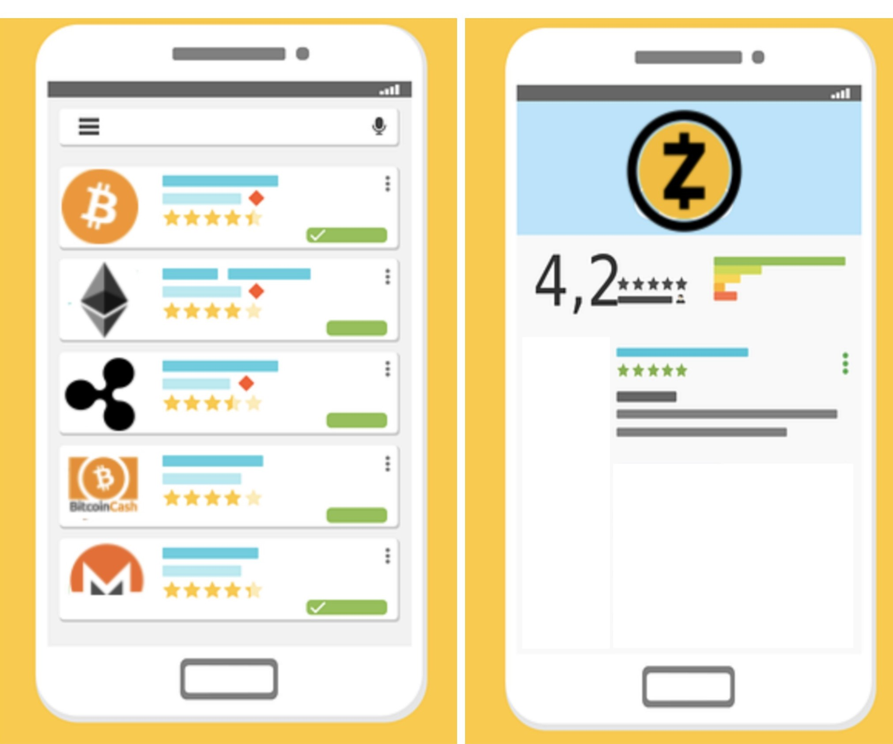

<p>
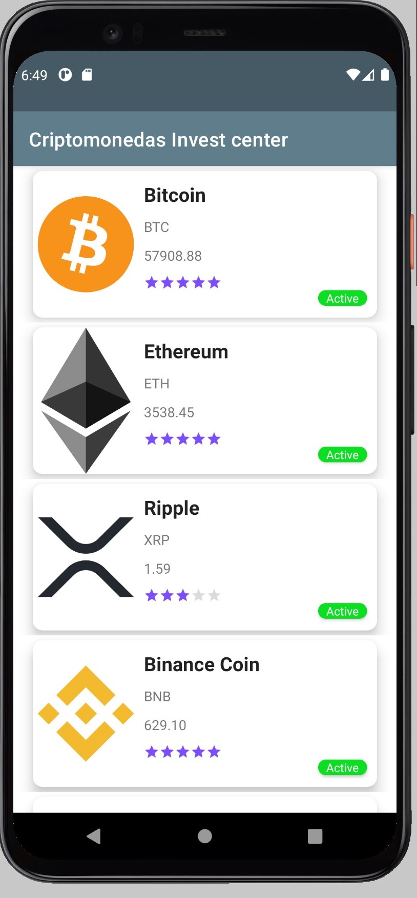
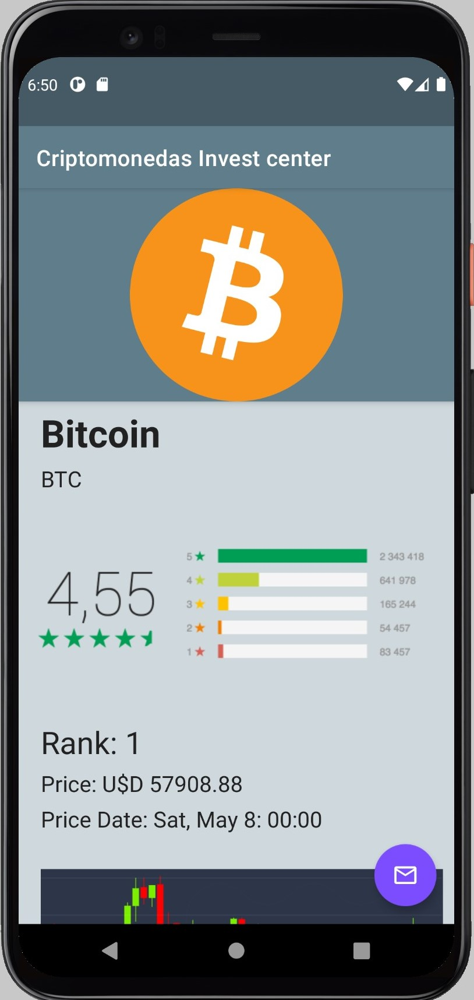
</p>

## Strings
>**Todos los textos que NO sean obtenidos a partir de la API REST deben ser traducibles.**
>**Los textos utilizados provienen de los recursos Android (strings.xml) cumpliendo con los requerimientos**


```kotlin
textViewRank.text = getString(R.string.rank, coinDetails.rank)
textViewPrice.text = getString(R.string.price, redondeo(coinDetails.price))
textViewPriceDate.text = getString(R.string.price_date, parseDate(coinDetails.priceDate))
```
```xml
<resources>
    <string name="app_name">Criptomonedas Invest center</string>


    <string name="send_email">Send Email</string>
    <string name="error_email">No Email app installed</string>
    <string name="name_crypto">Name: </string>
    <string name="symbol_crypto">Symbol: </string>
    <string name="price">Price: U$D %1s</string>
    <string name="active">Active</string>
    <string name="coin_logo">Coin Logo</string>
    <string name="price_date">Price Date: %1s</string>
    <string name="rank">Rank: %1s</string>
</resources>
```

```xml
<?xml version="1.0" encoding="utf-8"?>
<resources>
    <string name="app_name">Certificacion_TD</string>
    <string name="send_email">Mandar un Email</string>
    <string name="error_email">No hay app de Email Instalada</string>
    <string name="name_crypto">"Nombre: "</string>
    <string name="symbol_crypto">Símbolo:</string>
    <string name="price">Precio:  U$D %1s</string>
    <string name="active">Activo:</string>
    <string name="coin_logo">Logo de Moneda</string>
    <string name="price_date">Fecha del Precio: %1s</string>
    <string name="rank">Ranking: %1s</string>
</resources>


```
Cliente REST API         |  Abstracción
:-------------------------:|:-------------------------:
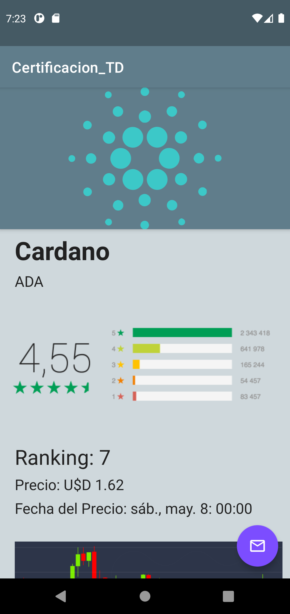 | 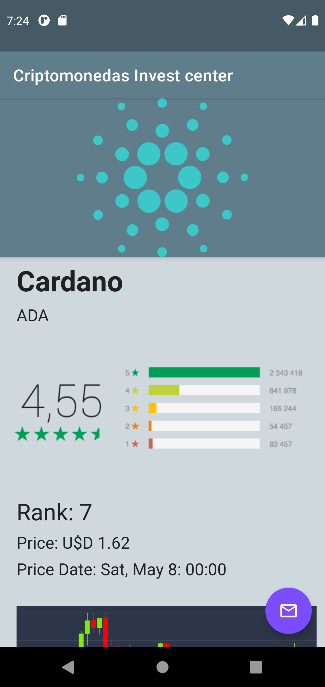


### Esta app esta hecha con mucho :muscle: y con la ayuda de:


Cliente REST API         |  Abstracción
:-------------------------:|:-------------------------:
 | 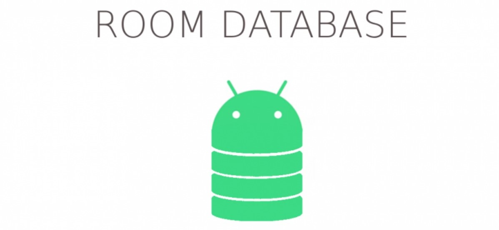

Arquitectura de Diseño     |  Injección de Dependencias
:-------------------------:|:-------------------------:
 |


Imágenes         |  Navegación
:-------------------------:|:-------------------------:
 |


## Ultimas consideraciones


Algo para mencionar es que la app hace una única llamada a la  Api cuando inicia para luego guardarlo en la base de datos, de ahí en más no se vuelve a llamar a la Api, ya que utilizamos como [fuente única de verdad](https://en.wikipedia.org/wiki/Single_source_of_truth) a la db local desde el repositorio uttilizando [Flow](https://developer.android.com/kotlin/flow?hl=es-419).
```kotlin
    suspend fun fetchOrSelectListOfCoins(): Flow<List<Coin>> = flow {
        val coinsDB = dao.selectAllCoins()
        if (coinsDB.isEmpty()){
            val coinsApi = api.fetchListOfCoins()
            dao.insertListOfCoins(coinsApi)
        }
        emit(dao.selectAllCoins())
    }
```

De la misma forma, con los detalles. La única salvedad es que debemos convertir a un flujo a la query, para poder comprobar si es nula. La lógica es la misma que el punto anterior.
```kotlin
    suspend fun fetchOrSelectCoinDetails(id:String):Flow<CoinDetails> = flow {
        val coinDetailsDB:CoinDetails = dao.selectCoinDetails(id)

        if (flowOf(coinDetailsDB).firstOrNull() == null){
            val coinDetailsApi = api.fetchCoinDetails(id)
            dao.insertCoinDetails(coinDetailsApi)
            Log.v("repositorio", "EMITIDO DE LA API")
            emit(coinDetailsApi)
        }else{
            emit(coinDetailsDB)
            Log.v("repositorio", "EMITIDO DE LA DB")
        }
    }

```


